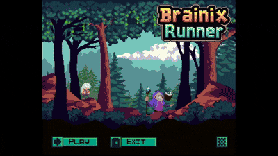

# 🧠 Brainix Runner

Brainix Runner is an arcade-style game written in **Zig** using [raylib](https://www.raylib.com/).
Your goal: survive, jump, and run through challenging levels while enjoying smooth gameplay and custom sound effects.



---

## 📦 Requirements

- [Zig](https://ziglang.org/download/) **version 0.15.1**
  > ⚠️ Other versions are not guaranteed to work. Please install exactly 0.15.1

- A C compiler (for linking with raylib). On Linux, install `gcc` or `clang`.
- [raylib](https://www.raylib.com/) is bundled through Zig’s build, no manual installation required.

---

## 🚀 Build & Run

Clone the repository and run:

```bash
zig build run
```
