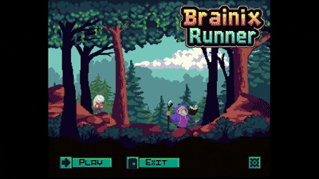

# Brainix Runner

Brainix Runner is an arcade-style game written in **Zig** using [raylib](https://www.raylib.com/).

Your goal: survive, jump, and run through challenging levels while enjoying smooth gameplay and custom sound effects.



---

## Download & Play

Precompiled binaries are available for **Windows, Linux (Ubuntu), and macOS**. You don't need to install Zig or compile the game yourself.

The executables are automatically built and updated through GitHub Actions after every successful push to the `main` branch.

| Platform | Download |
|---|---|
| Windows | [Brainix_Runner.exe](binaries/windows/Brainix_Runner.exe) |
| Linux (Ubuntu) | [Brainix_Runner](binaries/linux/Brainix_Runner) |
| macOS | [Download directory](binaries/macos/) |

**Important:** The game requires the `assets/` and `levels/` directories to work correctly. Download the complete repository and keep its directory structure intact.

The `.pdb` file included in the Windows directory is only used for debugging and is not required to play.

---

## Requirements

*Only required when building from source.*

- [Zig](https://ziglang.org/download/) **version 0.16.0**
  - Other versions are not guaranteed to work. Please install exactly version 0.16.0.
- A C compiler (for linking with raylib). On Linux, install `gcc` or `clang`.
- [raylib](https://www.raylib.com/) is bundled through Zig's build system; no manual installation is required.

---

## Build & Run

Clone the repository and run:

```bash
zig build run
```
